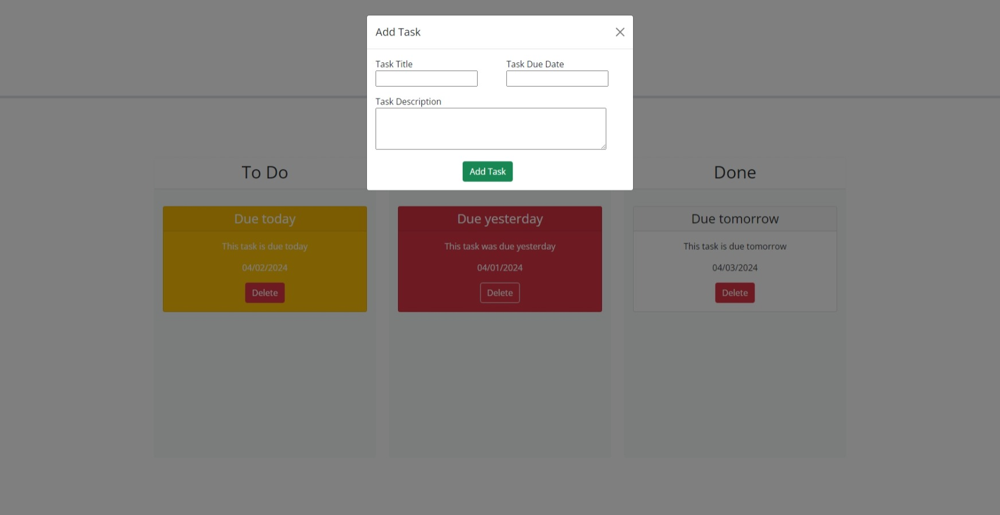

# Task Board

## Description

This webpage was written to be able to keep a track of tasks. It allows the user to enter a title, due date and description of the task. All 3 fields are required. You can only add one task
at a time as the form modal closes on submit but there is no limit on the number of tasks you can add. Once a task has been added it will be displayed on the task board. There is also the ability to drag and drop between the different lanes on the board. 
Also, there is a delete button on each task for when you no longer need/want the task on the board. I built this project because it gave me valuable experience practicing what
I have learned about Bootstrap, jQuery and jQuery UI. It also continued my use of localStorage. I learned how to create html elements from jQuery and how to use Bootstrap to customize the look and feel of the tasks.

## Usage

To use the webpage, please navigate to https://mattm479.github.io/task-board. You will need to click on the Add Task button and enter a title due date and description for the task - all 3 fields are required and then click Add Task to add the task. This webpage will look similar to the screenshot below:

## License

License can be found [here](LICENSE).